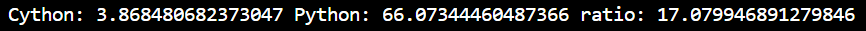

# Fast_Monte_Carlo_Option_Pricing
## We tested to price down-and-out options. Under the same level of standard error, we achieved around 17x faster the speed.
## Cython code runtime (seconds), Pure Python code runtime (second)s, and the ratio
