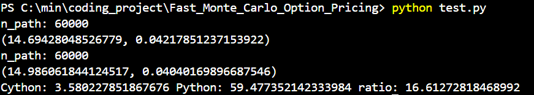

# Fast_Monte_Carlo_Option_Pricing
## We tested to price 3-year down-and-out options with daily barrier evaluation. Under the same level of standard error, we achieved around 17x faster the speed.
## Cython code runtime (seconds), Pure Python code runtime (seconds), and the ratio
